# Trading System Architecture Diagrams

## 1. System Overview

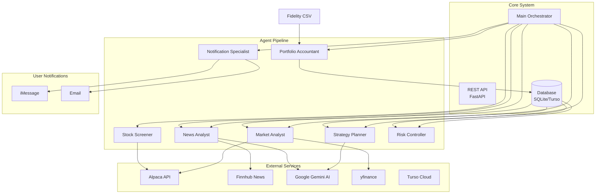

## 2. Agent Pipeline Flow

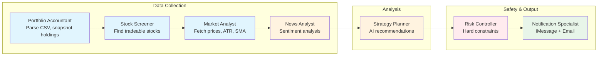

## 3. Time-Based Execution Modes

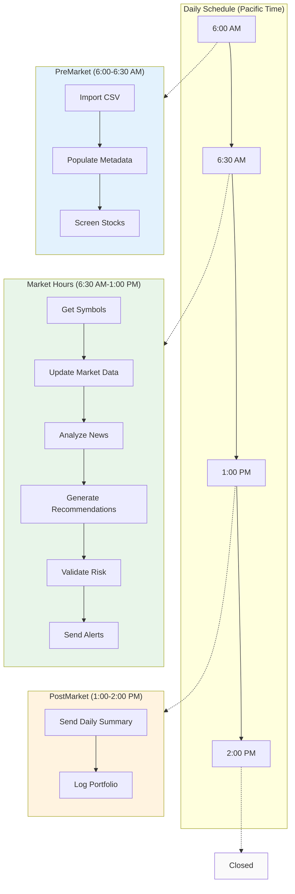

## 4. Market Data Fetching (Fallback Chain)

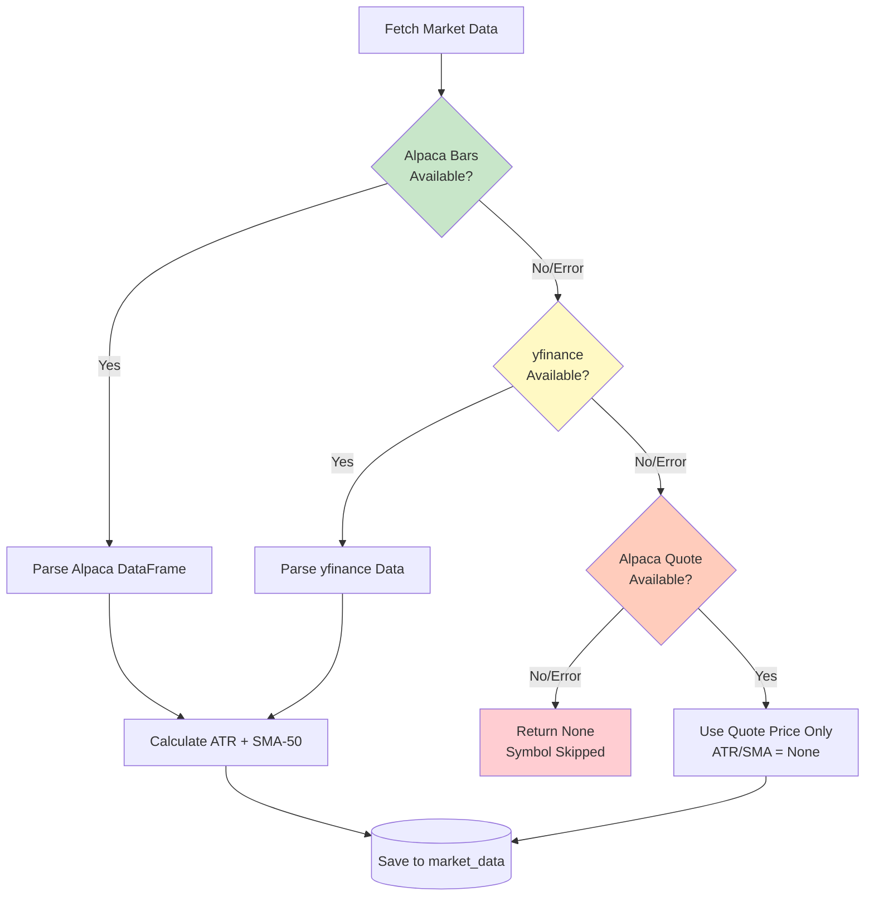

## 5. Risk Controller Validation

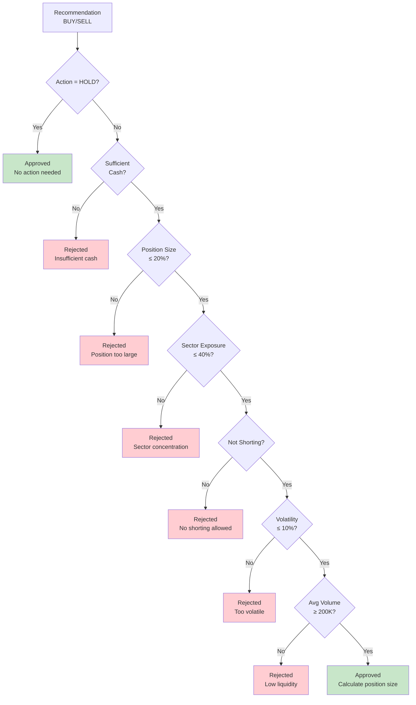

## 6. Stock Screener Flow

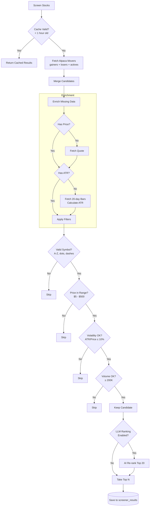

## 7. Database Schema (ER Diagram)

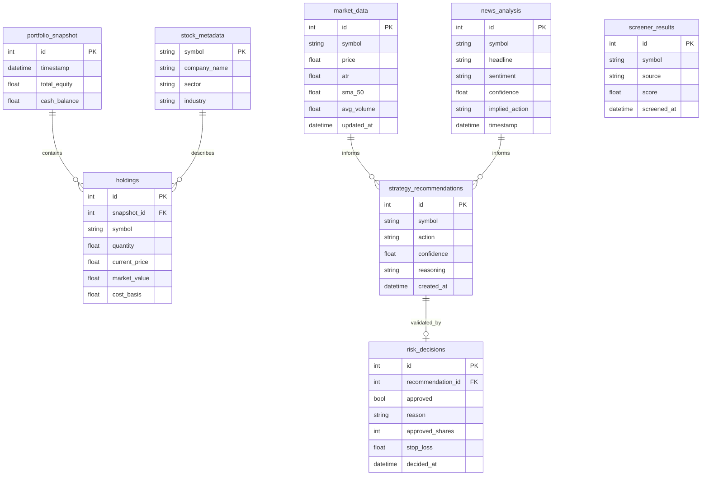

## 8. Strategy Planner AI Flow

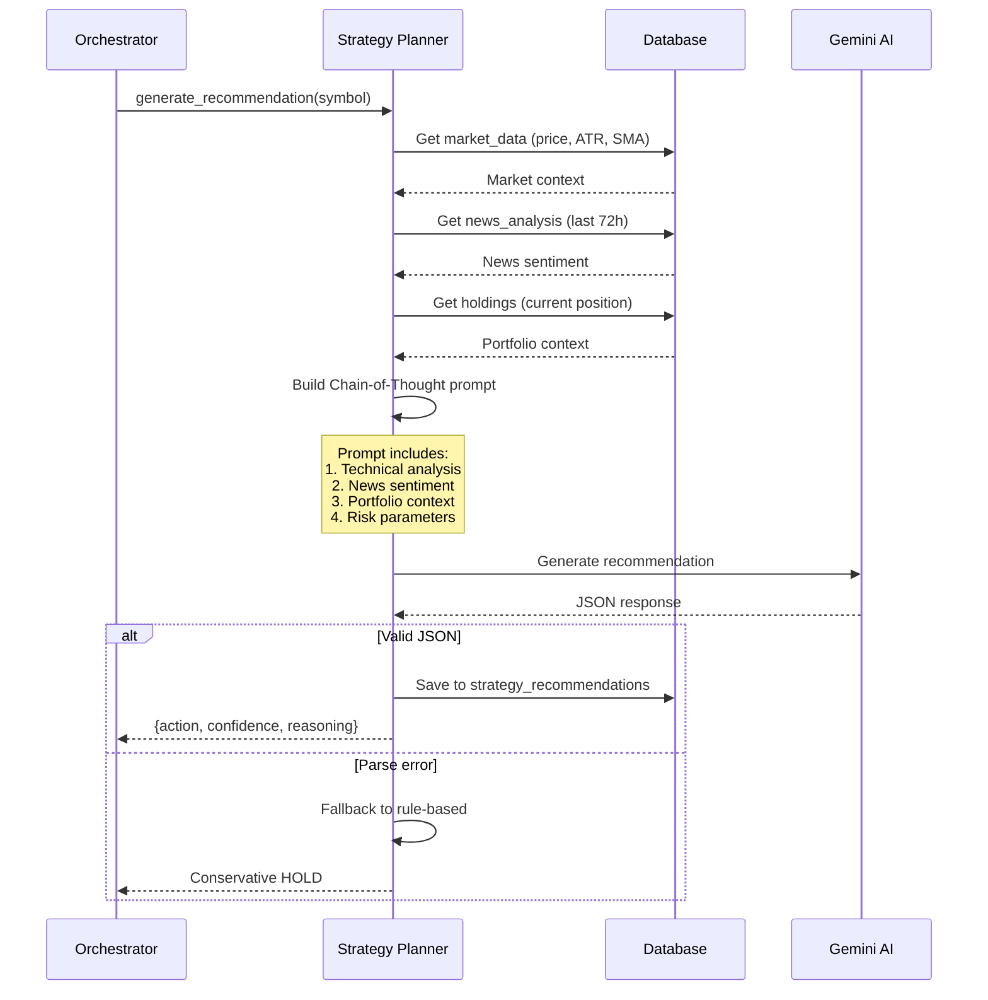

## 9. Notification Flow

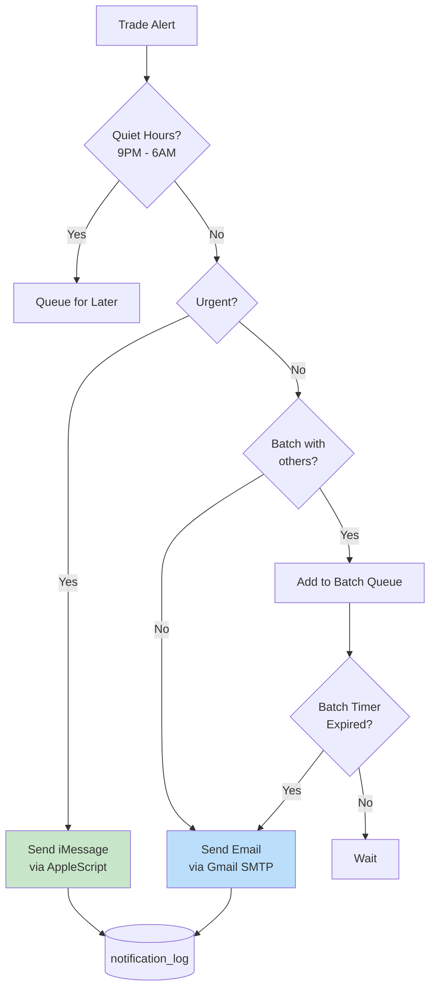

## 10. Configuration Hierarchy

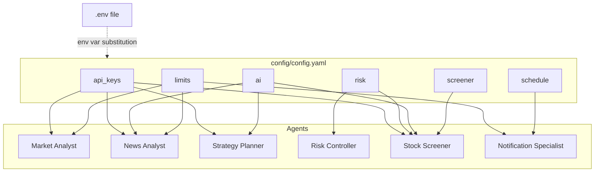

## 11. REST API Architecture

```mermaid
flowchart TB
    CLIENT[Client<br/>curl / Browser / App] --> AUTH{X-API-Key<br/>Valid?}

    AUTH -->|No| REJECT[401 Unauthorized]
    AUTH -->|Yes| ROUTER[FastAPI Router]

    ROUTER --> PORTFOLIO[/portfolio/*]
    ROUTER --> MARKET[/market/*]
    ROUTER --> AGENT[/agent/*]

    PORTFOLIO --> PA[Portfolio Accountant]
    MARKET --> MA[Market Analyst]
    AGENT --> SP[Strategy Planner]
    AGENT --> TA[Trade Advisor]

    PA --> DB[(Database<br/>Turso/SQLite)]
    MA --> DB
    SP --> DB
    TA --> DB

    style AUTH fill:#fff3e0
    style REJECT fill:#ffcdd2
    style DB fill:#e3f2fd
```

## 12. Database Modes

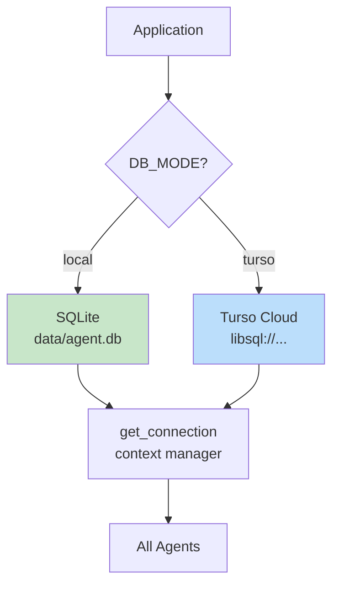

## Reading Order Suggestion

1. **Start here**: Diagram 1 (System Overview) + Diagram 2 (Pipeline Flow)
2. **Understand timing**: Diagram 3 (Execution Modes)
3. **Deep dive**: Diagrams 4-6 for specific agent logic
4. **Data model**: Diagram 7 (Database Schema)
5. **AI integration**: Diagram 8 (Strategy Planner)
6. **Output**: Diagram 9 (Notifications)
7. **API access**: Diagram 11 (REST API)
8. **Storage**: Diagram 12 (Database Modes)
